# Attention-guided Non-Local Network (ATNLC) for High Dynamic Range Image Synthesis
## Solution of HDR Challenge
## [ATNLC](https://codalab.lisn.upsaclay.fr/competitions/1514#results) - NTIRE 2022 - [Paper - tobeupdated...](google.com)

by [Tu Vo](https://tuvovan.github.io)
<!--  -->
## Content
- [ATNLC](#attsf-attention!-stay-focus!)
- [Getting Started](#getting-started)
- [Running](#running)
- [References](#references)
- [Citations](#citation)

## Getting Started

- Clone the repository

### Prerequisites

- Tensorflow 2.7.0+
- Tensorflow_addons
- Python 3.7+
- Keras 2.3.0
- PIL
- numpy


## Running
### Training 
- Preprocess
    - Download the [training data](https://codalab.lisn.upsaclay.fr/competitions/1514#participate)

    - Unzip the file

    - Prepare data:
    ```
    python src/create_dataset_img.py
    ```

- Train ATNLC 
    ```
    python main.py
    ```

- Test ATNLC
    ```
    python test.py
    ```

- Submit
    ```
    python test_submit.py
    ```
## Usage
### Training
```
usage: main.py  [-h] [--filter FILTER] 
                [--decoder_kernel DECODER_KERNEL]
                [--attention_filter ATTENTION_FILTER] 
                [--triple_pass_filter TRIPLE_PASS_FILTER]
                [--kernel KERNEL] [--encoder_kernel ENCODER_KERNEL] 
```
```
optional arguments:
  -h, --help            show this help message and exit
  --filter FILTER
  --attention_filter ATTENTION_FILTER
  --kernel KERNEL
  --encoder_kernel ENCODER_KERNEL
  --decoder_kernel DECODER_KERNEL
  --triple_pass_filter TRIPLE_PASS_FILTER
```
### Testing
- Download the weight [here](https://drive.google.com/file/d/1OinXMk2yqu51uj6EMK0uZWETDr2xWJbF/view?usp=sharing) and put it to the folder ```weights```
#### See results

```
usage: test.py  [-h] [--filter FILTER] 
                [--decoder_kernel DECODER_KERNEL]
                [--attention_filter ATTENTION_FILTER] 
                [--triple_pass_filter TRIPLE_PASS_FILTER]
                [--kernel KERNEL] [--encoder_kernel ENCODER_KERNEL] 
```
```
optional arguments:
  -h, --help            show this help message and exit
  --test_path TEST_PATH
  --save_path SAVE_PATH
  --filter FILTER
  --gpu GPU
  --attention_filter ATTENTION_FILTER
  --kernel KERNEL
  --encoder_kernel ENCODER_KERNEL
  --decoder_kernel DECODER_KERNEL
  --triple_pass_filter TRIPLE_PASS_FILTER
```

#### Result: to be updated ...

        Short image           |       Medium Image            |     Long Image              |        Output      
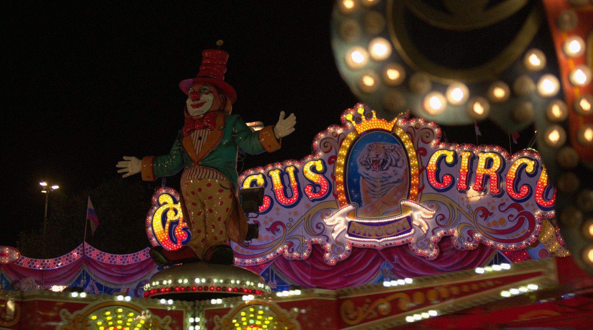    | 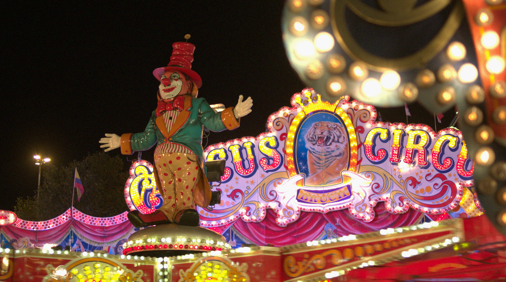   | 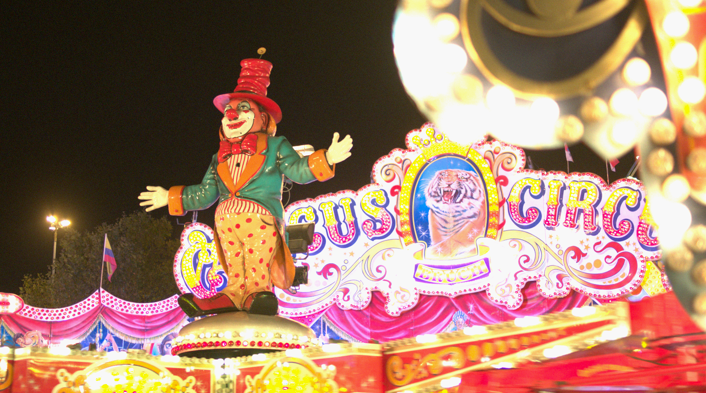   | 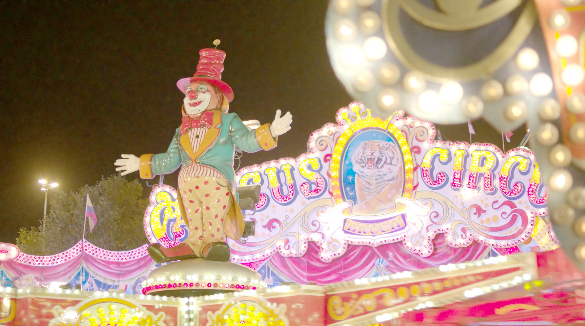
:----------------------------:|:-----------------------------:|:---------------------------:|:-----------------------:
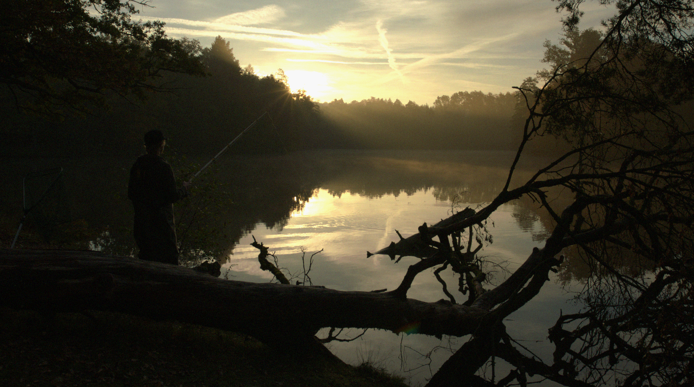    | 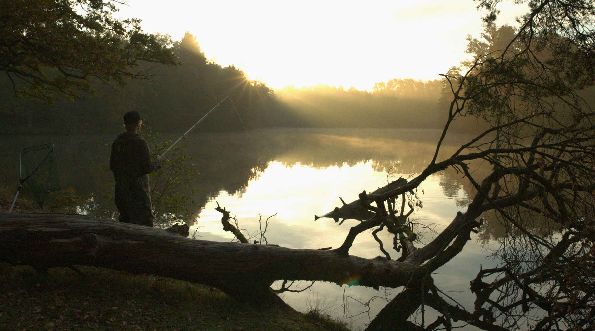   | 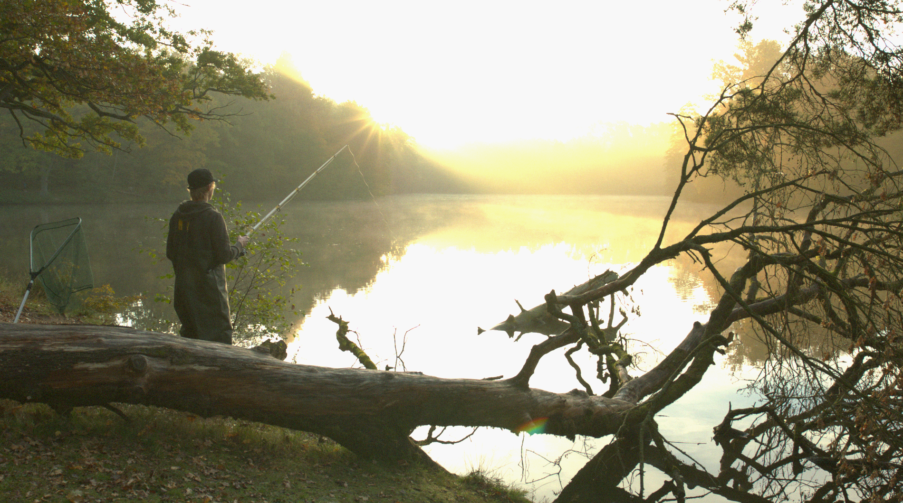   | 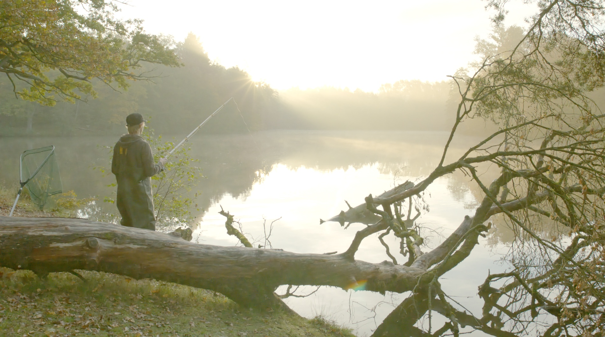
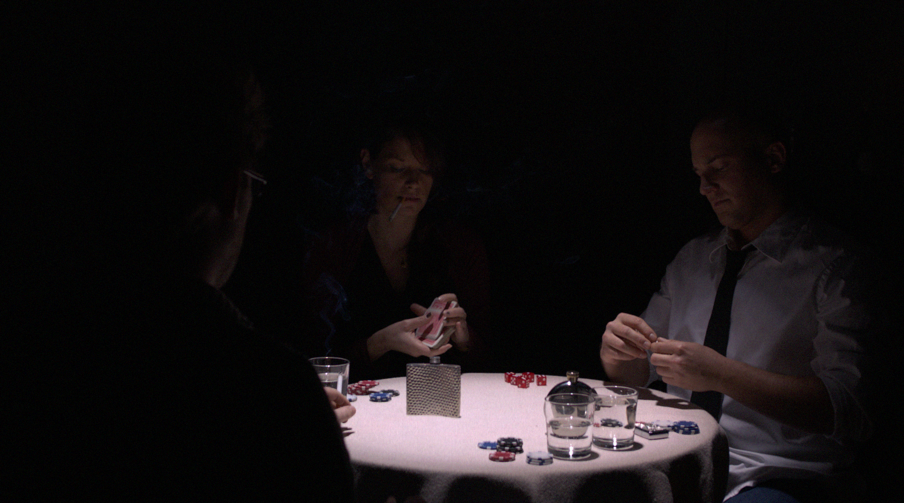    | 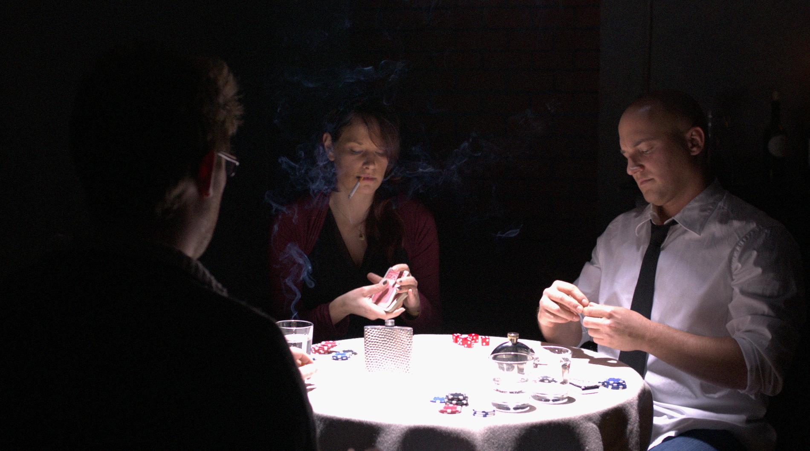   | 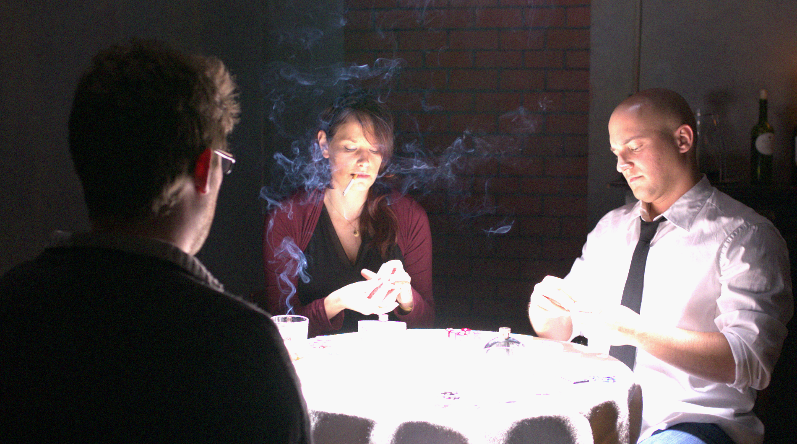   | 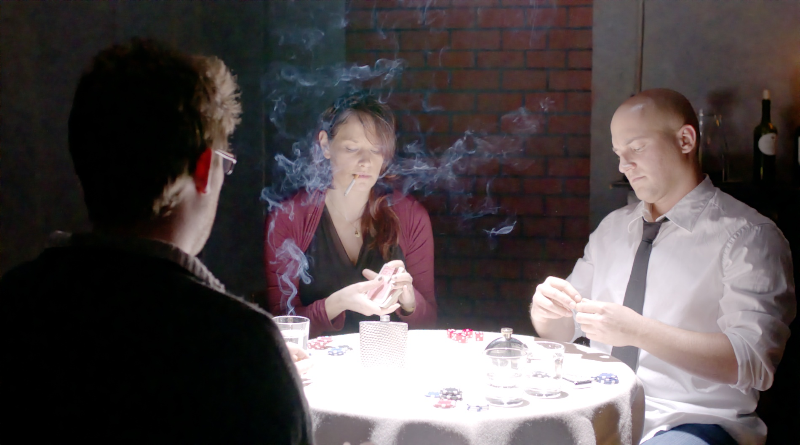


#### Submit
```
usage: test.py  [-h] [--filter FILTER] 
                [--decoder_kernel DECODER_KERNEL]
                [--triple_pass_filter TRIPLE_PASS_FILTER]
                [--kernel KERNEL] [--encoder_kernel ENCODER_KERNEL] 
                [--attention_filter ATTENTION_FILTER] [--zip_name ZIP_NAME]
```
```
optional arguments:
  -h, --help            show this help message and exit
  --test_path TEST_PATH
  --save_path SAVE_PATH
  --filter FILTER
  --gpu GPU
  --attention_filter ATTENTION_FILTER
  --kernel KERNEL
  --encoder_kernel ENCODER_KERNEL
  --decoder_kernel DECODER_KERNEL
  --triple_pass_filter TRIPLE_PASS_FILTER
  --zip_name ZIP_NAME
```
## License

This project is licensed under the MIT License - see the [LICENSE](https://github.com/tuvovan/ATTSF/blob/master/LICENSE) file for details

## References
[1] High Dynamic Range Image Synthesis Challenge - [NTIRE2022](https://codalab.lisn.upsaclay.fr/competitions/1514)

## Citation: to be updated ...
<!---
```
@InProceedings{Vo_2021_CVPR,
    author    = {Vo, Tu},
    title     = {Attention! Stay Focus!},
    booktitle = {Proceedings of the IEEE/CVF Conference on Computer Vision and Pattern Recognition (CVPR) Workshops},
    month     = {June},
    year      = {2021},
    pages     = {479-486}
}
```
-->
## Acknowledgments
<!-- - This work is heavily based on the code from the challenge [host](https://github.com/Abdullah-Abuolaim/defocus-deblurring-dual-pixel) . Thank you for the hard job. -->
